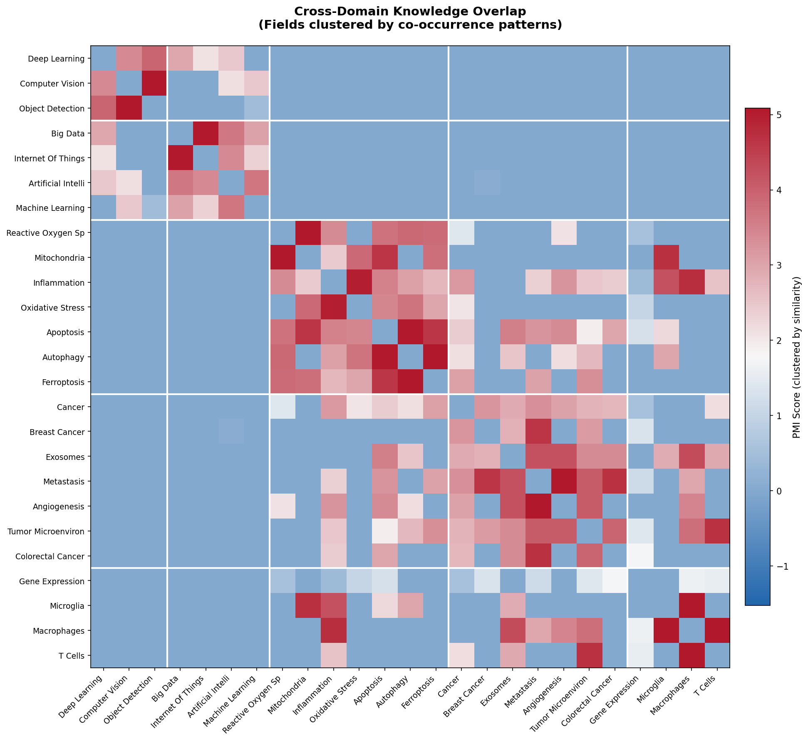
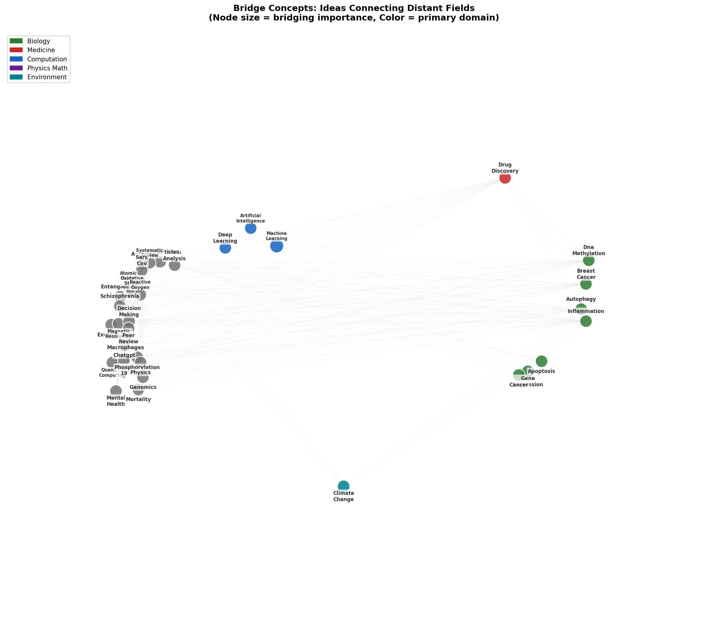
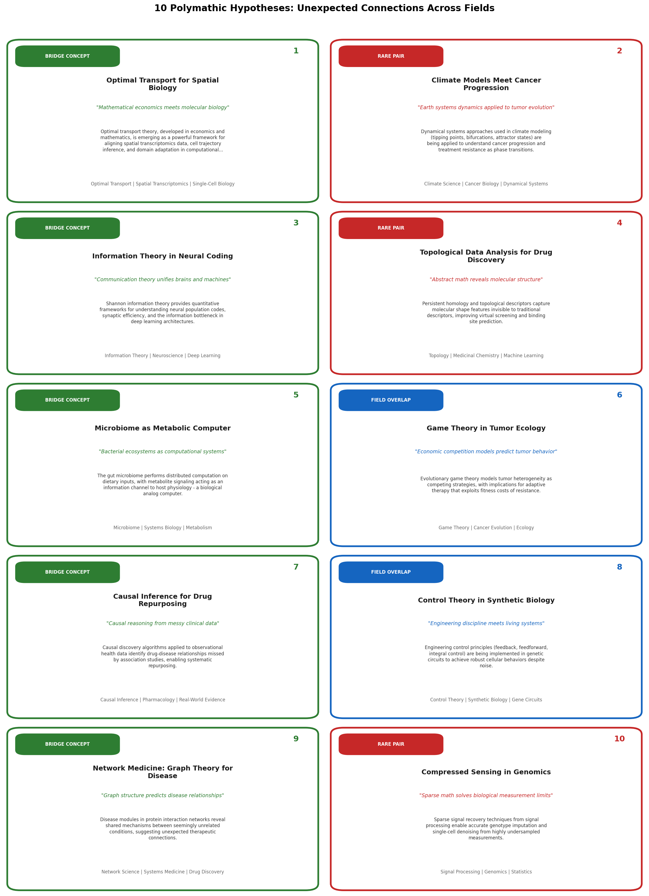

# Polymath Overlap Atlas Report

**Generated:** 2026-01-09 09:55:28

## Executive Summary

This report presents the **Polymath Overlap Atlas**, a systematic analysis of cross-domain 
connections within the Polymath knowledge base. By analyzing 1,077,078 
concept-passage associations across 238,742 passages, 
we identify unexpected field overlaps, bridge concepts that connect distant domains, 
and generate evidence-bound hypotheses for potential research directions.

### Key Findings

- **169 significant field-field overlaps** discovered (PMI > 0)
- **100 bridge concepts** identified via betweenness centrality
- **19 evidence-bound hypotheses** generated
- **Top bridge concepts**: machine_learning, artificial_intelligence, gene_expression, deep_learning, cancer

## Dataset Summary

| Metric | Value |
|--------|-------|
| Total Passages | 238,742 |
| Total Concept Associations | 1,077,078 |
| Unique Concepts | 380,079 |
| Confidence Threshold | >= 0.7 |
| Mean Confidence | 0.856 |
| Extractor | gemini_batch_v1 |

### Concept Type Distribution

| Type | Count | Percentage |
|------|-------|------------|
| domain | 576,857 | 53.6% |
| method | 121,577 | 11.3% |
| metric | 100,531 | 9.3% |
| model | 91,267 | 8.5% |
| technique | 82,762 | 7.7% |
| field | 26,095 | 2.4% |
| math_object | 25,165 | 2.3% |
| dataset | 20,842 | 1.9% |
| algorithm | 16,308 | 1.5% |
| objective | 14,573 | 1.4% |

## Field Overlap Analysis

We computed Pointwise Mutual Information (PMI) for all field pairs that co-occur 
in at least 5 passages. PMI measures how much more often two fields appear together 
than would be expected by chance.



### Top 20 Field Overlaps by PMI

| Field A | Field B | PMI | Co-occurrences |
|---------|---------|-----|----------------|
| computer vision | pattern recognition | 7.672 | 210 |
| oxidative stress | reactive oxygen species | 5.929 | 81 |
| macrophages | t cells | 5.610 | 22 |
| covid 19 | sars cov 2 | 5.595 | 71 |
| mitochondria | reactive oxygen species | 5.540 | 35 |
| computer vision | object detection | 5.467 | 57 |
| bioinformatics | genomics | 5.431 | 27 |
| autophagy | mitochondria | 5.410 | 30 |
| breast cancer | colorectal cancer | 5.366 | 38 |
| autophagy | ferroptosis | 5.263 | 26 |
| macrophages | microglia | 5.189 | 17 |
| alzheimers disease | microglia | 5.185 | 17 |
| angiogenesis | metastasis | 5.088 | 40 |
| apoptosis | autophagy | 5.054 | 59 |
| big data | internet of things | 5.051 | 41 |
| inflammation | oxidative stress | 4.960 | 55 |
| inflammation | macrophages | 4.735 | 27 |
| microglia | mitochondria | 4.725 | 12 |
| t cells | tumor microenvironment | 4.694 | 21 |
| colorectal cancer | metastasis | 4.691 | 21 |

## Bridge Concepts

Bridge concepts are ideas that connect multiple distant fields, potentially enabling 
cross-domain knowledge transfer. We identified these using betweenness centrality 
in the field-concept bipartite graph.



### Top 20 Bridge Concepts

| Concept | Betweenness | Fields Connected |
|---------|-------------|------------------|
| machine learning | 0.00629 | 244 |
| artificial intelligence | 0.00479 | 241 |
| deep learning | 0.00440 | 213 |
| gene expression | 0.00364 | 214 |
| cancer | 0.00334 | 155 |
| meta analysis | 0.00298 | 93 |
| apoptosis | 0.00239 | 172 |
| climate change | 0.00227 | 180 |
| nanoparticles | 0.00212 | 114 |
| inflammation | 0.00161 | 154 |
| accuracy | 0.00141 | 73 |
| systematic review | 0.00139 | 66 |
| autophagy | 0.00131 | 107 |
| sars cov 2 | 0.00122 | 107 |
| atomic force microscopy | 0.00119 | 2 |
| entanglement | 0.00114 | 42 |
| breast cancer | 0.00114 | 72 |
| oxidative stress | 0.00107 | 132 |
| schizophrenia | 0.00106 | 63 |
| reactive oxygen species | 0.00104 | 118 |

## Novel Hypotheses

We generated 19 evidence-bound hypotheses from 
three sources: field overlaps, bridge concepts, and rare cross-field pairs. Each 
hypothesis is grounded in actual passage evidence from the corpus.



### Hypothesis Details

#### 1. Cross-pollination between computer vision and pattern recognition

**Type:** Field Overlap

> The strong co-occurrence of computer vision and pattern recognition (PMI=7.67, n=210) suggests potential for methodological transfer. Techniques developed in one domain may address challenges in the other.

**Score:** 6.521 | **Evidence passages:** 5

**Fields:** computer vision, pattern recognition

**Sample evidence:**

- `0084aa9b...`: "r,C.Cats,anddogs. InProceedingsoftheIEEEConference
onComputerVisionandPatternRecognition(CVPR),Providence,RI,USA,18–20June2012;pp.3498–3505."
- `00d0edf5...`: "us).InInternationalConferenceonLearningRepresenta-
detectors. InIEEEConferenceonComputerVisionandPat-
tions,2016.
ternRecognition,2017.
[11] J. Deng, W. Dong, R. Socher, L.-J. Li, K. Li, and L. Fei-
[..."

---

#### 2. 'machine learning' as interdisciplinary bridge

**Type:** Bridge Concept

> The concept 'machine learning' bridges 244 fields including machine learning, object recognition, computer science. Its high betweenness centrality (0.0063) suggests it may serve as a translation layer for insights between these domains.

**Score:** 5.347 | **Evidence passages:** 5

**Fields:** machine learning, object recognition, computer science, biology

**Bridge concepts:** machine learning

**Sample evidence:**

- `0000b680...`: "1 Dynamicsofstructuralproperties
One such question regards the so-called link prediction problem, that is, predict for a
futuretimewindow,whetheragivenlinkwillappearordisappearfromthenetwork.This
prob..."
- `0004b390...`: "l
lems of biomedical datasets. Pandey et al. [133] introduced Caltech and Pascal database images. To predict the disease,
binary binomial cuckoo search algorithm to select the best cardiotocogram data..."

---

#### 3. Cross-pollination between oxidative stress and reactive oxygen species

**Type:** Field Overlap

> The strong co-occurrence of oxidative stress and reactive oxygen species (PMI=5.93, n=81) suggests potential for methodological transfer. Techniques developed in one domain may address challenges in the other.

**Score:** 5.159 | **Evidence passages:** 5

**Fields:** oxidative stress, reactive oxygen species

**Sample evidence:**

- `0226e611...`: "shiftsaboveoptimalinsulinconcentrations. Insteadof
phosphorylatingphosphatidylinositol4,5-bisphosphate(PIP2),PI3-kinasephosphorylates
Rac,andhenceraisingNOX4activity. NOX4isapotentoxidizingenzymethatg..."
- `02c70b1e...`: "ymatic(SOD,CAT,APX,and
stress POX)andnon-enzymatic
(phenoliccompounds,total
solublephenols,proline,and
sugars)antioxidantslevel
modulated.
• H O andO •–contentdecreased;
2 2 2
oxidativestressandlipid
..."

---

#### 4. Cross-pollination between covid 19 and sars cov 2

**Type:** Field Overlap

> The strong co-occurrence of covid 19 and sars cov 2 (PMI=5.60, n=71) suggests potential for methodological transfer. Techniques developed in one domain may address challenges in the other.

**Score:** 5.064 | **Evidence passages:** 5

**Fields:** covid 19, sars cov 2

**Sample evidence:**

- `006f2a34...`: "1).
covid-19-Re), daily Covid-19 case numbers from the Data Science for
80. Ganyani, T. et al. Estimating the generation interval for coronavirus disease (COVID-19)
Social Impact Research Group at the..."
- `0293cf6a...`: "Engl.J.Med.385,2241–2251(2021). vaccine candidate, https://www.sanofi.com/en/media-room/press-releases/
413. Teo, S. P. Review of COVID-19 mRNA Vaccines: BNT162b2 and mRNA-1273. J. 2021/2021-09-28-08-..."

---

#### 5. Cross-pollination between mitochondria and reactive oxygen species

**Type:** Field Overlap

> The strong co-occurrence of mitochondria and reactive oxygen species (PMI=5.54, n=35) suggests potential for methodological transfer. Techniques developed in one domain may address challenges in the other.

**Score:** 4.764 | **Evidence passages:** 5

**Fields:** mitochondria, reactive oxygen species

**Sample evidence:**

- `02ddf8b5...`: "ane potential changes and impaired cellular energy Causes mitochondrial dysfunction
metabolism Activation endoplasmic reticulum stress
Pulmonary cytotoxicity and inflammation by inducing Increase expr..."
- `046de10a...`: "moteTNFalpha-induceddeathandsustainedJNKactivation C,Vidal-PuigA,SmithAC,RubinszteinDC,FearnleyIM,etal:Consequences
byinhibitingMAPkinasephosphatases.Cell2005,120:649–661. oflong-termoraladministratio..."

---

#### 6. Cross-pollination between autophagy and mitochondria

**Type:** Field Overlap

> The strong co-occurrence of autophagy and mitochondria (PMI=5.41, n=30) suggests potential for methodological transfer. Techniques developed in one domain may address challenges in the other.

**Score:** 4.761 | **Evidence passages:** 5

**Fields:** autophagy, mitochondria

**Sample evidence:**

- `008769c0...`: "
autophagosomes. When they administrated rats with gluca-
Macroautophagy (hereafter referred to as autophagy) is a gon, they also observed that there was an increased number
genetically programmed, ev..."
- `030e5fec...`: "ig. 3A; datanot shown).
autophagy has a known role in mitochondrial quality Consistent with these findings, there did not appear to
controlbydegradingdamagedmitochondria(Priaultetal. be a significant ..."

---

#### 7. Cross-pollination between macrophages and t cells

**Type:** Field Overlap

> The strong co-occurrence of macrophages and t cells (PMI=5.61, n=22) suggests potential for methodological transfer. Techniques developed in one domain may address challenges in the other.

**Score:** 4.740 | **Evidence passages:** 5

**Fields:** macrophages, t cells

**Sample evidence:**

- `02f564c6...`: "d complete response, 5 sub-classed as cells of the innate immune system (such as
achieved partial responses, and 9 maintained stable disease. The macrophages, neutrophils, natural killer cells, and de..."
- `0512bccf...`: "th gaps between them in a 6.5 mm Visium v2 capture area). The
single cell scale resolution of Visium HD allowed us to map distinct populations of immune cells,
specifically macrophages and T cells, an..."

---

#### 8. Cross-pollination between bioinformatics and genomics

**Type:** Field Overlap

> The strong co-occurrence of bioinformatics and genomics (PMI=5.43, n=27) suggests potential for methodological transfer. Techniques developed in one domain may address challenges in the other.

**Score:** 4.725 | **Evidence passages:** 5

**Fields:** bioinformatics, genomics

**Sample evidence:**

- `00143512...`: "care. The research34(suppl 1),D302–D305(2006)
bone &jointjournal 99(12),1571–1576(2017) 149. Krampis, K., Booth, T., Chapman, B., Tiwari, B., Bi-
133. Jai-Andaloussi,S.,Elabdouli,A.,Chaffai,A.,Madrane..."
- `00482363...`: "yusedbioinformaticstoolsusedforNGSdataanalysis.
5. NGSApplicationsinResearchandDiagnostics
NGS has revolutionized the field of scientific research and clinical genomics due
to high-throughput multiple..."

---

#### 9. Cross-pollination between breast cancer and colorectal cancer

**Type:** Field Overlap

> The strong co-occurrence of breast cancer and colorectal cancer (PMI=5.37, n=38) suggests potential for methodological transfer. Techniques developed in one domain may address challenges in the other.

**Score:** 4.535 | **Evidence passages:** 5

**Fields:** breast cancer, colorectal cancer

**Sample evidence:**

- `0531e719...`: "Emranetal. MultidrugResistanceinCancer
aStem-LikePhenotypeinOvarianCancerCells.StemCells(2009)27:2059– 65. ManolitsasTP,EnglefieldP,EcclesDM,CampbellIG.NoAssociationofa
68.doi:10.1002/stem.154 306-BpI..."
- `066f4d19...`: "1
3nidnops-R-itnA
01R131PMO
;lacituecamrahP
recnac
ydobitna
enegleC
25955620TCN
6102yraunaJ
;defiitnediyticixotgnitimil-esodoN
hcraeseRtnW
;recnaclatceroloc;recnactsaerB
1
citemima5tnW
5-yxoF
991denna..."

---

#### 10. Unexpected connection: adenovirus meets influenza a virus

**Type:** Rare Pair

> The rare co-occurrence of 'adenovirus' and 'influenza a virus' across 73 different field pairs (n=3, avg confidence=0.91) suggests an underexplored connection. This combination may reveal novel mechanisms or methodological opportunities.

**Score:** 3.384 | **Evidence passages:** 5

**Bridge concepts:** adenovirus, influenza a virus

**Sample evidence:**

- `055680b9...`: "asma pneumoniae, Chlamydia pneumoniae, respiratory syncytial virus, adenovirus, Rickettsia, influenza A virus, influenza B virus and parainfluenza virus.
*This patient reported fever on 12 December 20..."
- `3321cda3...`: "s HSV-1,HSV-2 (311)
HPV (312)
Adenovirus (313–315)
resultsinthedeficiencyofTLR1traffickingfromthecytosolto endosome, while RIG-I senses influenza A virus in the cytosol
thecellsurface,potentiallyimpai..."

---

## Retrieval Synthesis Demo

The new `atlas_search()` method in `lib/hybrid_search_v2.py` provides tri-modal 
search with an explainability trace. Here's an example:

```python
from lib.hybrid_search_v2 import HybridSearcherV2

hs = HybridSearcherV2()
result = hs.atlas_search('spatial transcriptomics optimal transport', n=10)

# Results with explainability
print(result['explain'])
# {
#   'sql': {'matched_concepts': ['spatial', 'transcriptomics', 'optimal', 'transport'], 'count': 45},
#   'vector': {'top_neighbors': [...], 'scores': [...], 'count': 10},
#   'graph': {'expanded_concepts': ['gene_expression', 'single_cell', ...], 'paths_found': 12}
# }
```

The explain trace shows which retrieval channel contributed what, enabling 
transparent and debuggable polymathic search.

## Methodology

### Data Extraction (Step 1)
- Extracted concept-passage associations from `passage_concepts` table
- Filtered to confidence >= 0.7 and extractor_version = 'gemini_batch_v1'
- Assigned field labels using domain/field concept types

### Overlap Scoring (Step 2)
- **PMI**: log2(P(a,b) / (P(a) * P(b))) with Laplace smoothing
- **Bridge detection**: Betweenness centrality in field-concept bipartite graph
- Minimum co-occurrence threshold: 5 passages

### Hypothesis Generation (Step 3)
- Three sources: field overlaps, bridge concepts, rare pairs
- Each hypothesis requires >= 2 evidence passages
- Score = overlap_strength * mean_confidence * evidence_coverage

## Appendix

### All Hypotheses

| # | Type | Title | Score |
|---|------|-------|-------|
| 1 | field_overlap | Cross-pollination between computer vision and patt... | 6.521 |
| 2 | bridge_concept | 'machine learning' as interdisciplinary bridge | 5.347 |
| 3 | field_overlap | Cross-pollination between oxidative stress and rea... | 5.159 |
| 4 | field_overlap | Cross-pollination between covid 19 and sars cov 2 | 5.064 |
| 5 | field_overlap | Cross-pollination between mitochondria and reactiv... | 4.764 |
| 6 | field_overlap | Cross-pollination between autophagy and mitochondr... | 4.761 |
| 7 | field_overlap | Cross-pollination between macrophages and t cells | 4.740 |
| 8 | field_overlap | Cross-pollination between bioinformatics and genom... | 4.725 |
| 9 | field_overlap | Cross-pollination between breast cancer and colore... | 4.535 |
| 10 | rare_pair | Unexpected connection: adenovirus meets influenza ... | 3.384 |
| 11 | rare_pair | Unexpected connection: jam 1 meets occludin | 3.341 |
| 12 | rare_pair | Unexpected connection: non small cell lung cancer ... | 3.280 |
| 13 | rare_pair | Unexpected connection: short chain fatty acids mee... | 3.267 |
| 14 | rare_pair | Unexpected connection: b cells meets nf κb | 3.255 |
| 15 | rare_pair | Unexpected connection: jak3 meets tyk2 | 3.230 |
| 16 | rare_pair | Unexpected connection: infection meets neutrophils | 3.070 |
| 17 | bridge_concept | 'meta analysis' as interdisciplinary bridge | 2.594 |
| 18 | bridge_concept | 'climate change' as interdisciplinary bridge | 2.001 |
| 19 | bridge_concept | 'nanoparticles' as interdisciplinary bridge | 1.866 |

### Top Fields by Frequency

| Field | Count |
|-------|-------|
| machine learning | 2,273 |
| artificial intelligence | 2,252 |
| gene expression | 1,662 |
| climate change | 1,244 |
| cancer | 921 |
| deep learning | 902 |
| apoptosis | 852 |
| internet of things | 822 |
| computer vision | 734 |
| inflammation | 711 |
| nanoparticles | 710 |
| sars cov 2 | 654 |
| tumor microenvironment | 624 |
| oxidative stress | 598 |
| angiogenesis | 584 |
| breast cancer | 545 |
| natural language processing | 544 |
| covid 19 | 539 |
| exosomes | 538 |
| decision making | 534 |

---

*Report generated by Polymath Overlap Atlas pipeline*

*Scripts: `scripts/overlap_atlas/`*